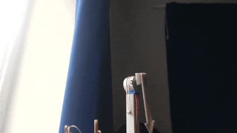

# ISS-tracker
Returns the altitude and azimuth of the ISS given latitude, longintude and TLE [two-line element set](https://en.wikipedia.org/wiki/Two-line_element_set) input; the ISS TLE data is sourced from [here](https://celestrak.org/NORAD/elements/gp.php?GROUP=stations&FORMAT=tle) but I may look at [this source](https://live.ariss.org/iss.txt) in the future to keep things simple. This data can be used to interface with an arduino to control a 28BYJ-48 stepper motor powered desktop pointer to provide a real time indication of the ISS' location, as shown in the GIF below:

